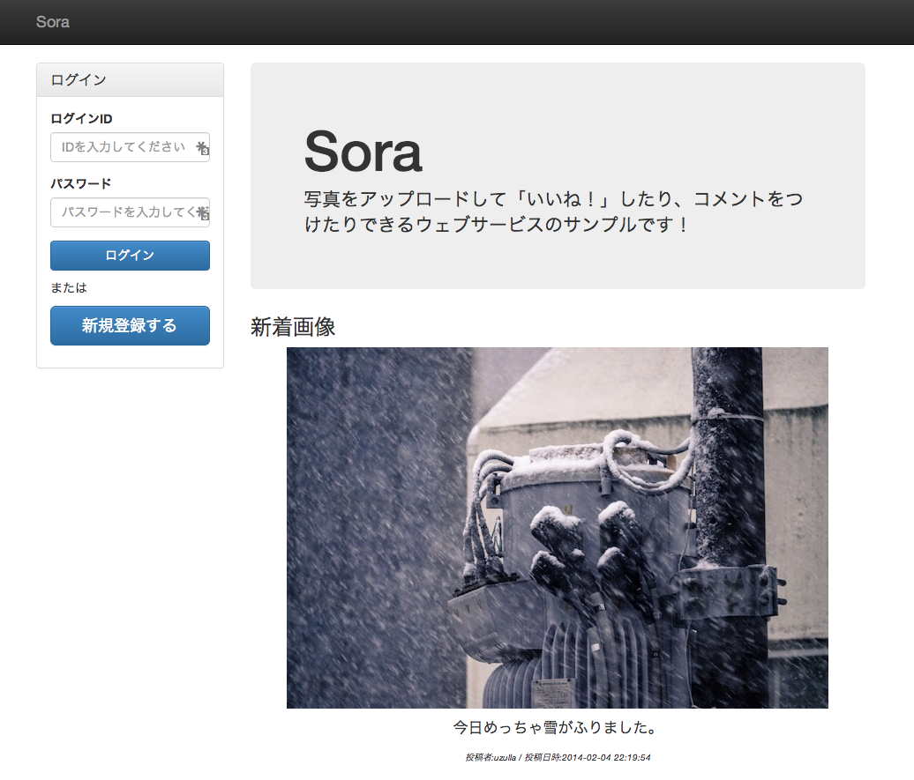
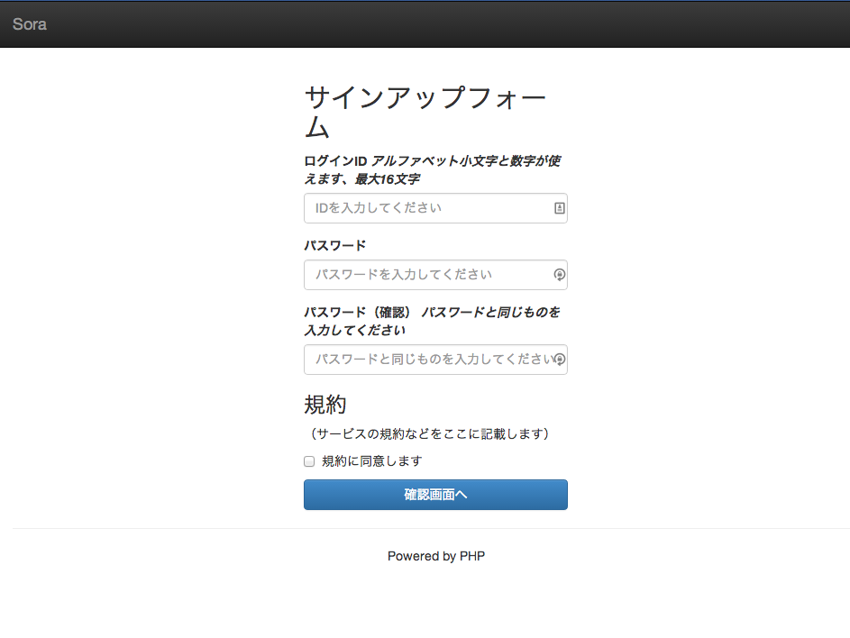
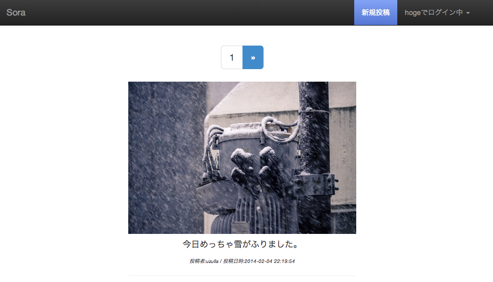
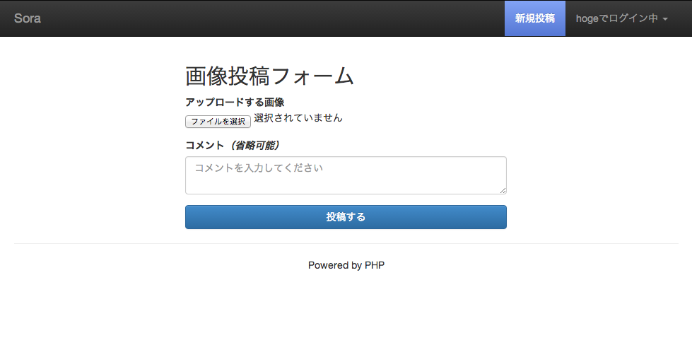
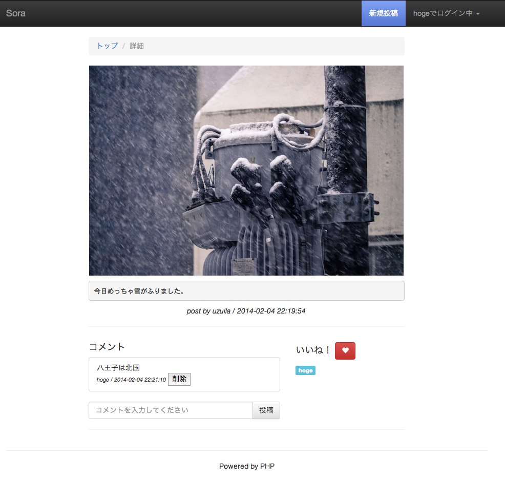
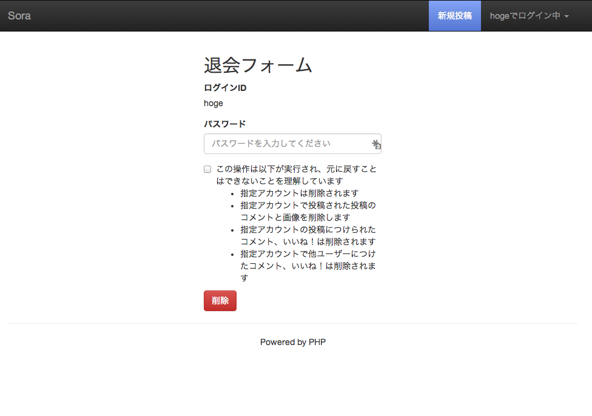
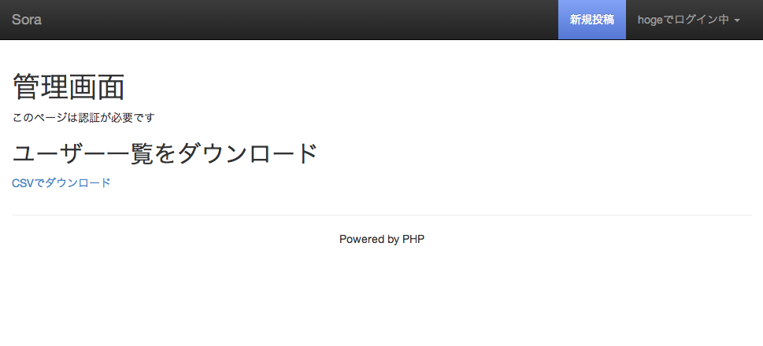

Sora
====

写真をアップロードして「いいね！」したり、コメントをつけたりできるウェブサービスのサンプル

(某件で使う予定でしたがボツになったので供養）


SCREEN SHOT
========

トップページ（未ログイン）


サインアップ


タイムライン


投稿


詳細画面


退会


管理者用画面


SETUP
=====

```
$ composer install
$ sqlite3 sqlite.db < schema.sqlite3.sql
$ cd htdocs
$ php -S 127.0.0.1:8888

open http://127.0.0.1:8888/
```
